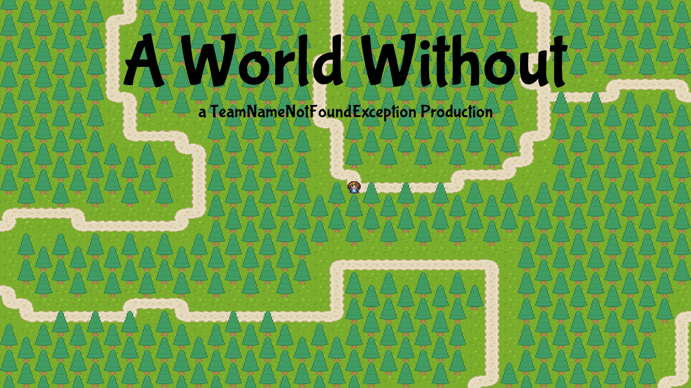

# GameJamMV

Repository for the first Game Jam MV. The topic was bees with three challenges:

* Implement a easteregg
* Explain why bees are important
* Add releation to Mecklenburg-Vorpommern

As engine we use libgdx.

## Assets

* Own assets

* Bee hive sound (https://freesound.org/people/knova/sounds/172335/) (CC-BY-NC)

* start.ogg (https://opengameart.org/content/bleeding-out) (CC0)

* Characters (https://opengameart.org/content/tiny-16-expanded-character-sprites) (CC-BY) 

* Other Graphic, Fonts and sounds by Kenney (https://www.kenney.nl/assets) (CC0)

## Authors

For the game jam we found the team TeamNameNotFoundException.

* seeseekey - https://seeseekey.net
* Naxos84 - https://github.com/Naxos84/
* ErasSoft https://erassoft.de
* Eisenwart
* Teluel
* CodesDoWork
* styrix358

## License

The source code is licensed under MIT license.

## Weblinks

You can find the offical repository under:

https://github.com/seeseekey/GameJamMV
